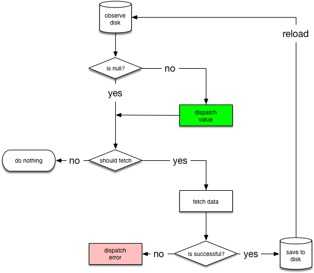

## mcBitCoin native Android app

The idea of developing BitCoin app was to fulfill the following business requirements:

* User is able to see the prices of Bitcoin for the last two weeks in USD with the appropriate date of the record.

* User by tapping on a list of items navigates to the detail screen.

* User is able to see in detailed screen prices of Bitcoin in the three following currencies USD, GBP, EUR for the given day.

  

Mentioned solution was built under the newest and recommended stack of the technology by the Google. App was developed under the Jetpack components that follows the best practices that helps to reduce boilerplate code giving the nice and smooth experience during the development and maintaining stages. Project was built under the following pieces of the Jetpack components package library:

* **Kotlin** - as a programming language supported by the Google for Android development .
* **Dagger Hilt** - as a dependency injection. Hilt extends previous version of dependency injection library which was Dagger 2. In my option Google made a huge step forward with publishing Hilt library for dependency injection. It helps developers to minimize time of producing boilerplate code that is recently handled by the Hilt library &quot;under the table&quot;. DI was never that clean and bright as it is now with help of the Hilt.
* **ViewBinding** - is the fresh breath for developers. Since this change, Kotlin synthetics are no longer supported, and they become deprecated. On top of that view binding is a simpler and more handy solution build on top of data binding. With help of it  developers can reduce boilerplate codes relevant to handle view states.
* **Retrofit** - to provide a REST client for the API network server. It makes relatively easy approach to fetch data from the remote source.
* **LiveData** - to observe any changes of the data that are in an active life cycle state.
* **Coroutines** - as a concurrency design pattern to handle asynchronously tasks that are to be run on a background thread to do not block the main thread that could block the app and disturb the user experience.
* **Couroutine Flow** - is built on top of Kotlin coroutines to handle streams of data that you can transform in multi-thread ways. It basically gives the power of reactive stream of data to the coroutines in similar way to the Observables of RxJava.
* **MVVM** -  Model-View-ViewModel design pattern as an overall app architecture that separate objects into following layers Models, Views, ViewModels.
* **Repository pattern** - as a single source of truth paradigm recommended by the Google used to keep the data coming from different sources in one place.
* **Network Bound Resource** - is a Jetpack component developed with intention to handle the complex and advantages tasks that gives user experience of app usage in off-line mode.

### Solution

Flow of the user experience of the app follow the **Network Bound Resource** algorithm that handled **loading**, **success**, and **error** states. The intention to use Kotlin coroutine flows, mentioned algorithm and the **Resource class** developed by the Google was to provide off-line experience for the app users. Basically, the source of the data presented to the User Interface origin from the local database, and it is overridden by the data fetched from the network when the user is on-line. Solution observes the local database for the required stream of resource. When there is no Internet connection appropriate massage can be handled to the user. When the user become on-line the algorithm fetches fresh data from the network and allocates it in to the local db where stream of data is sent to the UI and presented to the user. With help of this approach app is able to resolve multi-threading asynchronous tasks which could involve different sources of data like for example local DB and remote network. User is able to get experience even when working off-line and the data will refresh by itself as soon as app becomes on-line.

* **Main screen** - app fetch Bitcoin price records for the last 14 days from the network.
* **Detail screen** - app fetch current currency rates in GBP and EUR relative to the USD. Based on that, algorithm calculates Bitcoin price in GBP and EUR currencies provides for the user price of Bitcoin in three following currencies USD, GBP, EUR.

### Architecture

Repository pattern to keep different sources of data in one place.

### States

* **Error**

  

* **Loading**

  

* **Success**

  

  

Enjoy ;)